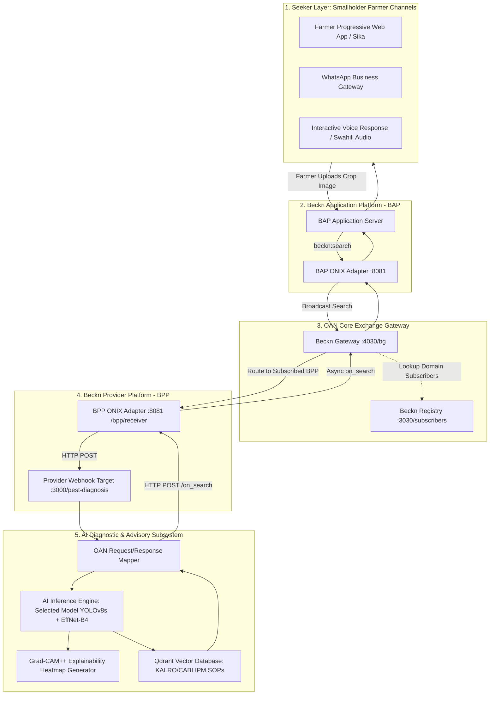

# OAN Kenya Beckn/ONIX Integration Architecture Note

**Document Reference:** `OAN-KENYA-ARCH-PEST-01`  
**Author:** Deloitte Agri-Africa & OAN Kenya Core Technology Team  
**Context:** Open Agriculture Network (OAN) Kenya — Digital Public Infrastructure (DPI)  
**Status:** Architectural Specification & Phasing Blueprint  

---

## 1. Executive Context & Objective

The Open Agriculture Network (OAN) Kenya is a Digital Public Infrastructure (DPI) data exchange built upon open protocols (**Beckn Protocol** and **Beckn ONIX**). OAN facilitates interoperable transactions between smallholder farmers (seekers using BAPs) and agricultural solution providers (serving via BPPs).

During Sprint-2 and Sprint-3 deliberations, **Pest and Disease Detection** was identified as a critical advisory service required by smallholder farmers. However, selecting an AI model cannot be done based solely on published benchmarks, as laboratory-trained models regularly suffer severe domain collapse when confronted with real Kenyan smallholder conditions (e.g., equatorial sunlight, low-cost Transsion/Tecno smartphone sensors, intercropped maize-bean clutter, and local pest biotypes like *Spodoptera frugiperda*).

This document details:
1. How the **Pest Detection Model Benchmarking Lab** operates 100% independently from the live OAN exchange during model evaluation.
2. How the selected winning model will transition into an **OAN-compatible Beckn Provider Platform (BPP)** service.
3. The exact placement and API contracts of the AI inference microservice within the Beckn/ONIX topology.
4. What Beckn/ONIX integration activities **must be deferred** until after model selection to avoid premature architectural overhead.

---

## 2. Independent Operation of the Benchmarking Lab

The benchmarking lab is designed to run in complete isolation from the live OAN network:

```
┌────────────────────────────────────────────────────────────────────────┐
│               INDEPENDENT BENCHMARKING LAB (STANDALONE)                 │
│                                                                        │
│   ┌────────────────────┐          ┌────────────────────────────────┐   │
│   │ Kenya Test Dataset │          │ Candidate Model Suite          │   │
│   │ (Golden / Field /  │ ───────► │ (YOLOv8, EfficientNet-B4,      │   │
│   │  Lab / Augmented)  │          │  MobileNetV4, BioCLIP, etc.)   │   │
│   └────────────────────┘          └───────────────┬────────────────┘   │
│                                                   │                    │
│                                                   ▼                    │
│                                   ┌────────────────────────────────┐   │
│                                   │ Normalized JSON Results Schema │   │
│                                   └───────────────┬────────────────┘   │
│                                                   │                    │
│                                                   ▼                    │
│                                   ┌────────────────────────────────┐   │
│                                   │ Metrics Engine & KALRO Rubric  │   │
│                                   │ (Accuracy, F1, Latency, Safety)│   │
│                                   └────────────────────────────────┘   │
└────────────────────────────────────────────────────────────────────────┘
```

### Why Decoupling is Mandatory
1. **No External Network Dependencies**: The lab executes offline or in local environments without requiring active Beckn Gateways, BAP callers, ONIX subscribers, or Redis transaction registries.
2. **Deterministic Reproducibility**: Image ingestion, preprocessing, inference execution, and metric calculations occur locally under strict hardware and parameter tracking.
3. **Multi-Model Concurrency**: The lab feeds the **exact same image tensor** across 5–10 candidate models simultaneously to evaluate relative accuracy, bounding box overlap, and millisecond latency. A Beckn BPP provider typically exposes only a single service.
4. **Agility**: Rapid iteration, dataset expansion (10 → 50 → 500 images), and error analysis can proceed without redeploying Docker containers or altering ONIX network routing tables.

---

## 3. The Future OAN/Beckn Provider Topology

Once the winning model (or ensemble) is selected and certified through the benchmarking lab, it will be encapsulated as an **OAN-Compatible Provider Service**.



### Component Breakdown
1. **Network Domain**:
   - Registered in Beckn Registry as `crop-protection:oan:kenya` or `knowledge-advisory:oan:kenya`.
   - Layer 2 Schema URL points to verified Beckn agricultural ontology:
     `https://raw.githubusercontent.com/beckn/missions/main/VISTAAR/layer2/crop-protection_oan_1.0.0.yaml`.
2. **ONIX BPP Adapter (`bpp-pest-adapter`)**:
   - Containerized instance of `fidedocker/onix-adapter` listening on port `8081`.
   - Handles cryptographic request signing, header verification, and mTLS with OAN Gateway.
   - Subscriber ID: `bpp-pest-detection-ke`.
   - Forwarding URL: `http://pest-provider:3000/pest-diagnosis`.
3. **Provider Backend Microservice**:
   - Houses the selected model weights, focus/quality validation gate, and Qdrant IPM advisory retriever.
   - Exposes REST endpoints conforming to the internal OAN service contract.

---

## 4. API Contract & Data Mapping Specification

When a farmer captures an image in the PWA or WhatsApp bot, the transaction executes asynchronously over Beckn semantics (`search` $\rightarrow$ `on_search` or `select` $\rightarrow$ `on_select`).

### 4.1 Inbound Beckn Request (`beckn:search` Payload from Gateway)
```json
{
  "context": {
    "domain": "crop-protection:oan:kenya",
    "country": "KEN",
    "city": "std:020",
    "action": "search",
    "core_version": "1.1.0",
    "bap_id": "bap-oan-seeker",
    "bap_uri": "http://bap-adapter:8081/bap/receiver",
    "transaction_id": "tx-ke-20260906-89412",
    "message_id": "msg-99210-4412",
    "timestamp": "2026-09-06T10:45:00Z"
  },
  "message": {
    "intent": {
      "category": {
        "id": "DIAGNOSTIC_SERVICE"
      },
      "item": {
        "descriptor": {
          "code": "PEST_AND_DISEASE_IDENTIFICATION"
        },
        "tags": [
          {"code": "image_url", "value": "https://media.oan.ke/uploads/farm_maize_whorl_01.jpg"},
          {"code": "crop", "value": "Maize"},
          {"code": "county", "value": "Nakuru"},
          {"code": "gps", "value": "-0.3541,35.9422"},
          {"code": "language", "value": "sw"}
        ]
      }
    }
  }
}
```

### 4.2 Internal AI Inference Request (`POST /predict` on Inference Microservice)
The BPP wrapper unpacks the Beckn tags into standard multipart form data or JSON:
```json
{
  "request_id": "tx-ke-20260906-89412",
  "image_url": "https://media.oan.ke/uploads/farm_maize_whorl_01.jpg",
  "crop": "Maize",
  "location": {
    "county": "Nakuru",
    "latitude": -0.3541,
    "longitude": 35.9422
  },
  "preferred_language": "sw"
}
```

### 4.3 Internal AI Inference Response (`NormalizedPrediction`)
The inference engine returns standardized JSON:
```json
{
  "request_id": "tx-ke-20260906-89412",
  "crop": "Maize",
  "diagnosis": "Fall Armyworm (Spodoptera frugiperda)",
  "pest": "Fall Armyworm",
  "disease": null,
  "scientific_name": "Spodoptera frugiperda",
  "confidence": 0.942,
  "uncertain": false,
  "severity": "STAGE_2_MODERATE",
  "bounding_boxes": [
    {
      "class": "fall_armyworm_larva",
      "confidence": 0.942,
      "bbox_xyxy": [140.5, 210.0, 310.2, 395.8]
    }
  ],
  "explainability_heatmap_url": "https://media.oan.ke/xai/tx-ke-20260906-89412_heatmap.jpg",
  "advisory": {
    "ipm_tier_1_cultural": "Weka mchanga safi au jivu katikati ya jicho la mmea kuua funza.",
    "ipm_tier_2_biological": "Tumia dawa asilia ya mwarobaini (Neem extract).",
    "ipm_tier_3_chemical": "Nyunyizia Emamectin Benzoate (Prove 1.9 EC, 10ml kwa bomba la lita 20).",
    "safety_phi_days": 7
  },
  "model_id": "yolov8s_effnet_hybrid_v1",
  "model_version": "1.0.4",
  "inference_time_ms": 14.8,
  "recommend_human_review": false
}
```

### 4.4 Outbound Beckn Response (`beckn:on_search` Callback to Gateway)
The BPP adapter translates the inference JSON into Beckn Layer 2 Catalog items:
```json
{
  "context": {
    "domain": "crop-protection:oan:kenya",
    "action": "on_search",
    "bpp_id": "bpp-pest-detection-ke",
    "bpp_uri": "http://bpp-pest-adapter:8081/bpp/receiver",
    "transaction_id": "tx-ke-20260906-89412",
    "message_id": "msg-99210-4412"
  },
  "message": {
    "catalog": {
      "bpp/descriptor": {
        "name": "OAN Kenya AI Crop Diagnostic & IPM Service",
        "short_desc": "Automated pest and disease identification certified by KALRO"
      },
      "bpp/providers": [
        {
          "id": "provider-kalro-safic-ai",
          "descriptor": {"name": "KALRO / SAFIC Crop Diagnostic Provider"},
          "items": [
            {
              "id": "DIAG_RESULT_01",
              "descriptor": {
                "name": "Utambuzi: Funza wa Jeshi (Fall Armyworm)",
                "code": "Spodoptera frugiperda",
                "short_desc": "Uhakika wa AI: 94.2% (Moderate Infestation)",
                "images": [
                  {"url": "https://media.oan.ke/xai/tx-ke-20260906-89412_heatmap.jpg"}
                ]
              },
              "tags": [
                {"code": "confidence", "value": "0.942"},
                {"code": "ipm_cultural", "value": "Weka mchanga safi au jivu katikati ya jicho la mmea."},
                {"code": "ipm_chemical", "value": "Emamectin Benzoate (10ml/20L), PHI: 7 days"},
                {"code": "audio_advisory_url", "value": "https://media.oan.ke/audio/faw_swahili_adv.mp3"}
              ]
            }
          ]
        }
      ]
    }
  }
}
```

---

## 5. What Integration Work is Postponed Until After Model Selection

To maintain engineering discipline and avoid wasting cycles on throwaway plumbing:

| Activity | Current Phase (Benchmarking Lab) | Post-Selection Phase (OAN Provider Onboarding) | Rationale |
| :--- | :---: | :---: | :--- |
| **Model Evaluation & Bake-Off** | **ACTIVE** | Maintenance | Core task: identify the winning model using objective evidence on Kenya data. |
| **Model Registry & Adapters** | **ACTIVE** | Active | Standardizes inference interfaces across all candidate architectures. |
| **FastAPI `/predict` Endpoint** | **ACTIVE** | Active | Exposes the normalized diagnostic service locally for testing. |
| **ONIX Docker Container Setup** | **POSTPONED** | Execution | ONIX adapter setup (`bpp-onboarder.sh`) is fast (~15 mins) once the endpoint is fixed. |
| **Registry Domain Registration** | **POSTPONED** | Execution | Network Domain registration in Beckn Registry requires finalized schema URLs. |
| **Keycloak OAuth2 / mTLS** | **POSTPONED** | Execution | Security certificates and token handshakes apply only to live network communications. |
| **BAP Routing Rule Modification** | **POSTPONED** | Execution | Adding `config/local-simple-routing-BAPCaller.yaml` routes is needed only during end-to-end exchange QA. |
| **Live Telemetry (Grafana/Jaeger)**| **POSTPONED** | Execution | Distributed tracing across network hops is established during exchange integration. |

---

## 6. Summary for System Architects

- The **Model Benchmarking Lab** is an independent, scientific evaluation harness running locally in Python.
- Models must adhere to the **`BasePestModel`** interface and return standardized **`NormalizedPrediction`** JSON.
- Once the winning model is selected via the KALRO-scored golden dataset, wrapping it as a Beckn ONIX provider requires only implementing the `request_mapper.py` and `response_mapper.py` adapters inside `oan_adapter/`.
- This ensures **zero risk to the live OAN sandbox** while delivering a rigorous, empirical AI selection process.
